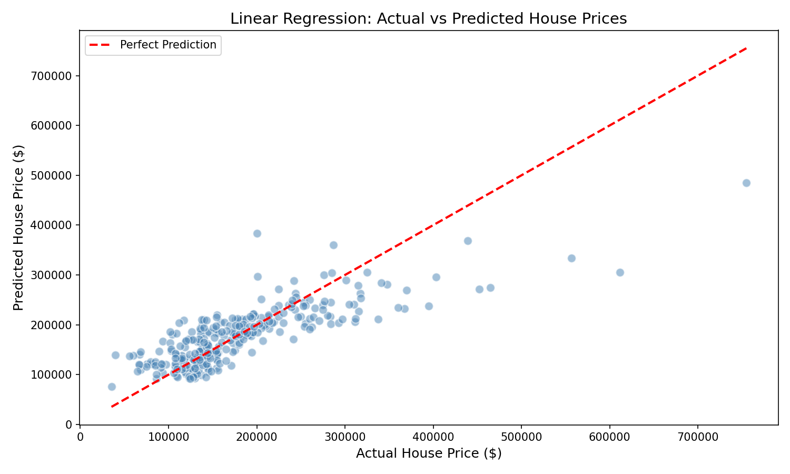

# House Price Prediction - Linear Regression

## SkillCraft Technology | ML Internship | Task 01

### Objective
Predict house prices using Linear Regression model based on square footage, number of bedrooms and bathrooms.

### Dataset
Kaggle - House Prices Advanced Regression Techniques

### Features Used
- GrLivArea (Square Footage)
- BedroomAbvGr (Number of Bedrooms)
- FullBath (Number of Bathrooms)

### Model Results

| Metric | Value |
|--------|-------|
| R2 Score | 63.4% |
| MAE | $35,788 |
| RMSE | $52,976 |

### Tools & Libraries
| Tool | Purpose |
|------|---------|
| Python | Programming Language |
| Google Colab | Development Environment |
| pandas | Data Manipulation |
| numpy | Numerical Computing |
| matplotlib | Data Visualization |
| scikit-learn | Machine Learning |

### Output

